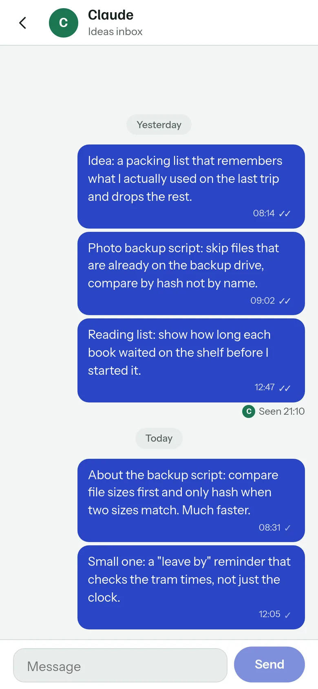
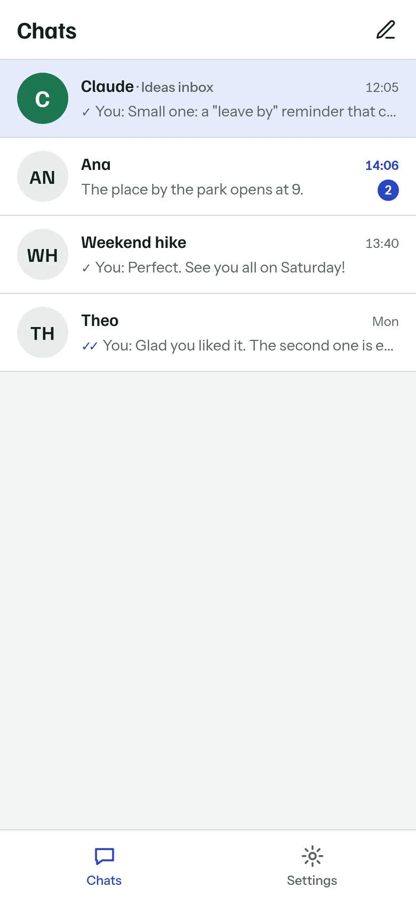
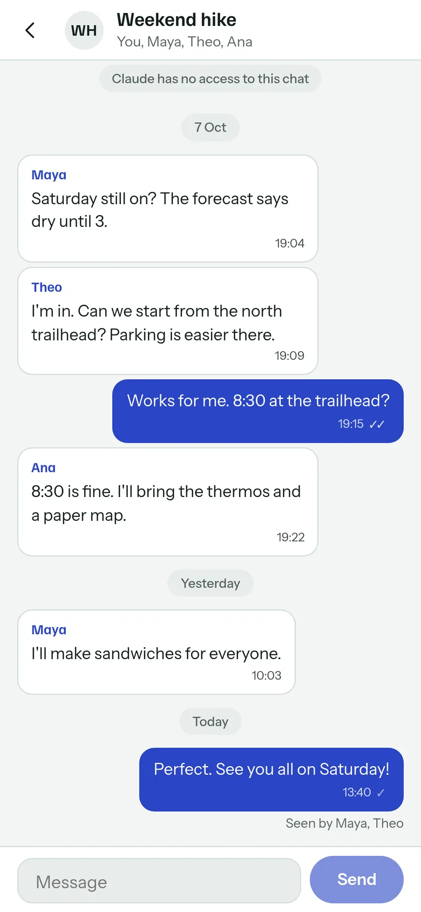
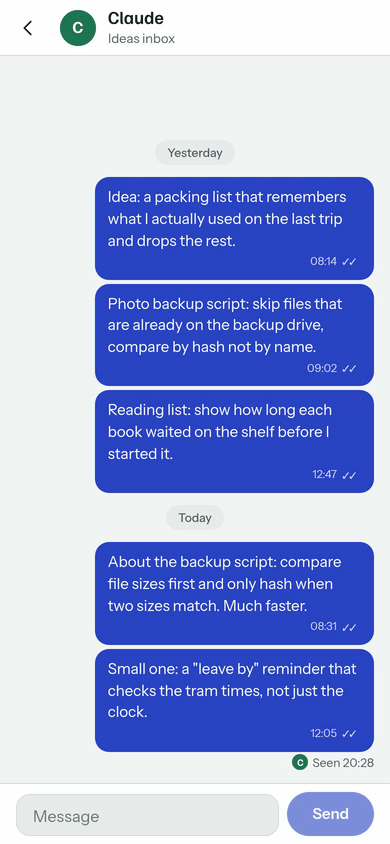
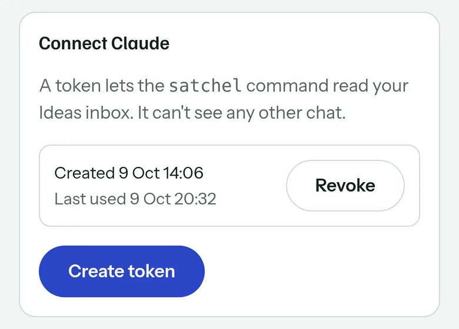
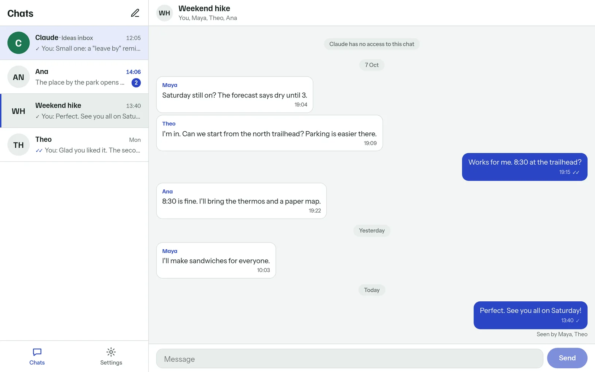
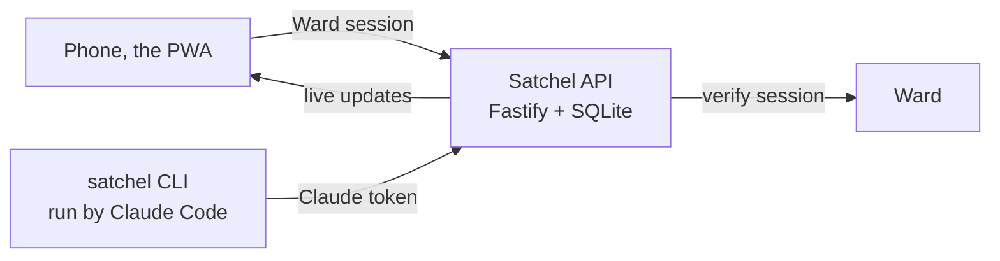

# Satchel

Satchel is a small text messenger for its owner and a few friends. Its first chat, the Ideas inbox, is with Claude. The owner writes ideas there from a phone, and Claude Code reads them later at home through the `satchel` command.

<p align="center">
  
</p>

At home, Claude runs the CLI and gets only what it hasn't read yet:

```text
$ satchel unread
Ideas inbox · 2 unread · seen up to #10

#11  2026-10-09 08:31  About the backup script: compare file sizes first and only hash when two sizes match. Much faster.
#12  2026-10-09 12:05  Small one: a "leave by" reminder that checks the tram times, not just the clock.

Oldest first. Later messages can correct earlier ones. Gaps in numbers are normal.
When you have read them all, run:  satchel seen 12
$ satchel seen 12
Seen up to #12.
```

**Status:** Personal project, built but not deployed yet. All fourteen briefs are done: the Ideas inbox, the `satchel` CLI, Ward sign-in, friend chats, live updates and push notifications. Push was tried end to end in headless Chrome only; iPhone push is untested.

## What it does

- Keeps ideas written on the go in one chat, in strict order. Nothing is edited or deleted; a correction is a later message.
- Lets Claude Code catch up when the owner says "check my inbox". `satchel unread` prints every unread idea oldest first, and `satchel seen N` marks them read.
- Shows what Claude has read with seen ticks and a "Seen" line, the way WhatsApp does.
- Runs one-to-one and group chats with friends, with ticks, "Seen by" and unread badges. Claude can't read those chats.
- Installs to the home screen as a PWA, updates live over a WebSocket, and can send push notifications.

A notes app would hold the ideas too. Satchel adds an exact read marker, so Claude picks up only what is new, and an idea written while Claude is reading waits for the next read instead of being skipped. It is text only. There are no photos, files, search, editing or deleting, and Claude doesn't reply in the chat.

## Screenshots

| The chat list | A group with friends | Sending an idea |
|---|---|---|
|  |  |  |

In the GIF, the owner sends an idea and it gets one tick. Claude then runs `satchel seen` at home, and the "Seen" line moves under the new idea without a reload.

The owner creates the Claude token in Settings and can revoke it there:



On a laptop the chat list and the open chat sit side by side:



## How it works

Four npm workspaces. `shared` holds the zod contract every other part uses. `server` is Fastify with SQLite. It gives each message a server `seq` and keeps one seen marker per member that only moves forward. `web` is the React PWA. It signs in through Ward, the estate's sign-in service, and talks to `/api/*`. `cli` is the `satchel` command, which reads only the Ideas inbox through `/claude/*` with a Claude token.



More in [docs/architecture.md](docs/architecture.md).

## Run it locally

Requires Node 24 or later and the local Ward container from `wzd_auth/infrastructure/local` on <http://localhost:8792>. Its seed registers Satchel, gives your account a role on it, and fills the three `WARD_` values in this repo's `.env`, so copy `.env.example` to `.env` before you run it.

```bash
npm install
npm run dev
```

Then open <http://localhost:5175/satchel/> and sign in. The API listens on port 8807. Env vars, tests, push and the CLI against a local server are in [docs/getting-started.md](docs/getting-started.md).

## Deploy and setup

Deploying is a hand-run owner step through vps-deploy. These live in [docs/owner-setup.md](docs/owner-setup.md):

- **Owner setup.** Registering Satchel in Ward, the first deploy, the Claude token, installing the CLI and the line for `~/.claude/CLAUDE.md`
- **Push notifications.** Making the VAPID key pair and turning notifications on per device
- **Inviting a friend.** A Ward account with the `member` role on `satchel`

## Project layout

| Path | What lives there |
|---|---|
| `shared/` | zod schemas for every route, limits, seen rules |
| `server/` | Fastify API, SQLite store, Ward guard, live updates, push |
| `web/` | React PWA, served under `/satchel/` |
| `cli/` | the `satchel` command and its guide |
| `infrastructure/` | Dockerfile and compose file for the API container |
| `corpus/` | design wiki, decisions and the numbered briefs |

## Docs

- [docs/](docs/README.md): setup, architecture, the owner's steps, and the images used here
- [corpus/](corpus/index.md): the project wiki, with decisions, status and the briefs

## License

[MIT](LICENSE).
