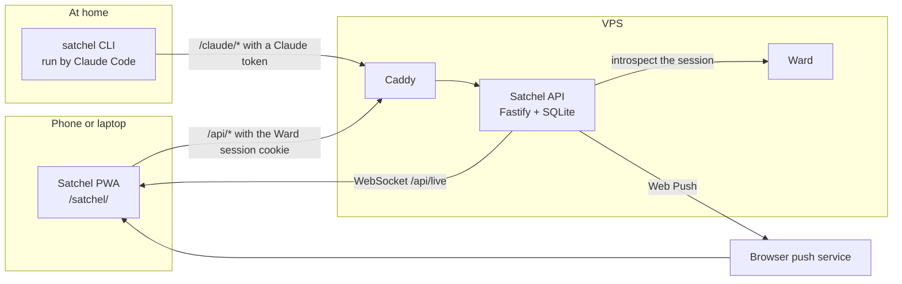

# Architecture

Satchel is four npm workspaces. `shared` holds the zod schemas for every
route, the limits and the seen rules, and the other three import it.
`server` is the Fastify API with one SQLite file; its store is the only code
that runs SQL. `web` is the React PWA, served under `/satchel/`. `cli` is the
`satchel` command Claude Code runs. In production Caddy serves the PWA and
forwards `/satchel-api/*` to the API container with the prefix stripped, so
the server's own routes are `/api/*` and `/claude/*`.

## Two doors

- **`/api/*`** is for people. The guard verifies the Ward session locally,
  then asks Ward for the account's grants. No grant on `satchel` means no
  access. The `admin` role marks the owner, who gets the Ideas inbox; `member`
  is a friend.
- **`/claude/*`** is for the CLI. It takes only a Claude token, which is bound
  to the owner's Ideas inbox. It reads no cookie and never calls Ward.

The server refuses a Claude token on `/api/*` and a Ward cookie on `/claude/*`.

## A message, step by step

1. The owner writes an idea; the web app posts it with a client ID, so a
   retry can't store it twice.
2. The server stores it with the next `seq` and moves the sender's seen
   marker to it. Messages are append-only. Database triggers refuse updates
   and deletes.
3. The server publishes the message over the WebSocket to every member's open
   tabs. Polling takes over while the socket is down.
4. In a friend chat with push set up, every member except the sender also
   gets a notification. The Ideas inbox sends none.
5. At home, `satchel unread` returns the messages above Claude's marker,
   oldest first. Reading moves no marker.
6. `satchel seen N` moves Claude's marker forward to `N`, never back. The
   phone gets a live event, and "Seen" moves under message `N`.

Reading and marking seen are two separate calls. An idea written between
them stays unread for next time instead of being skipped.

## Read more

- [corpus/wiki/architecture.md](../corpus/wiki/architecture.md): ports, the
  guard's cross-site and lost-grant rules, data, deploy and the changes in
  other repos
- [corpus/wiki/messages-and-seen.md](../corpus/wiki/messages-and-seen.md):
  `seq`, client IDs, seen markers, ticks and "Seen by"
- [corpus/wiki/claude-access.md](../corpus/wiki/claude-access.md): the CLI,
  the token and the guide
- [corpus/wiki/decisions.md](../corpus/wiki/decisions.md): what was decided
  and what was rejected
- Code: [server/src/store.ts](../server/src/store.ts),
  [server/src/ward/guard.ts](../server/src/ward/guard.ts),
  [server/src/routes/](../server/src/routes/),
  [cli/src/guide.md](../cli/src/guide.md)
